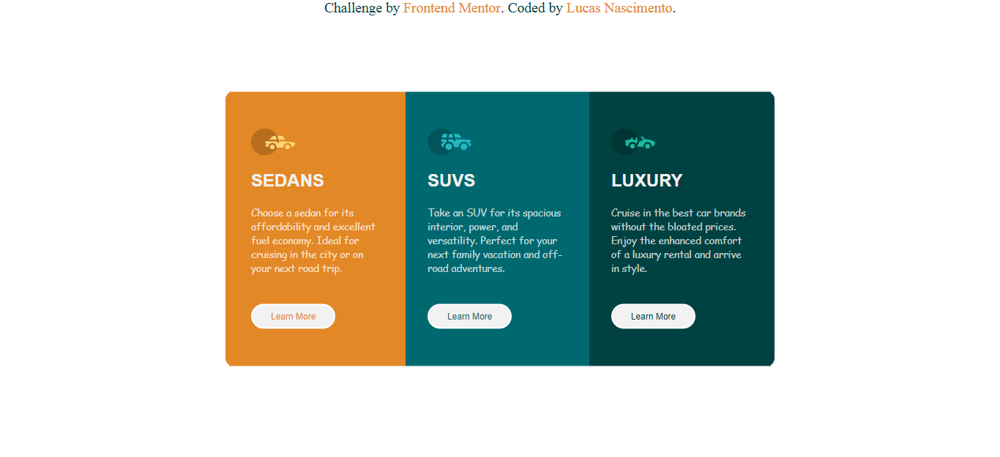

# Frontend Mentor - 3-column preview card component

## Table of contents

- [Overview](#overview)
  - [The challenge](#the-challenge)
  - [Screenshot](#screenshot)
- [Built with](#built-with)
  - [Continued development](#continued-development)
- [Author](#author)

## Overview

My first challenge, my first page with flexbox. Lots of questions about positioning

### The challenge

Users should be able to:

- View the optimal layout for the page depending on their device's screen size
- See hover states for all interactive elements on the page

### Screenshot

# Built with

- Semantic HTML5 markup
- CSS custom properties
- Flexbox

### Continued development

flexbox
unidades de medidas

## Author

- Frontend Mentor - [@Lucsn](https://www.frontendmentor.io/profile/Lucsn)
- LinkedIn - [@Lucsn](https://www.linkedin.com/in/lucsn/)
